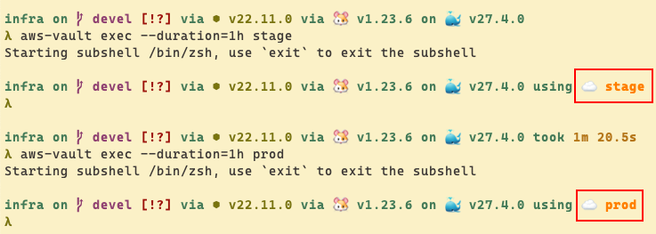
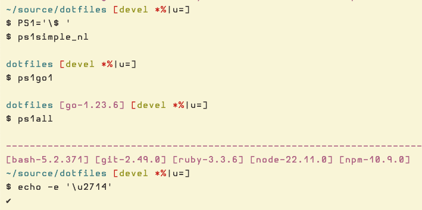
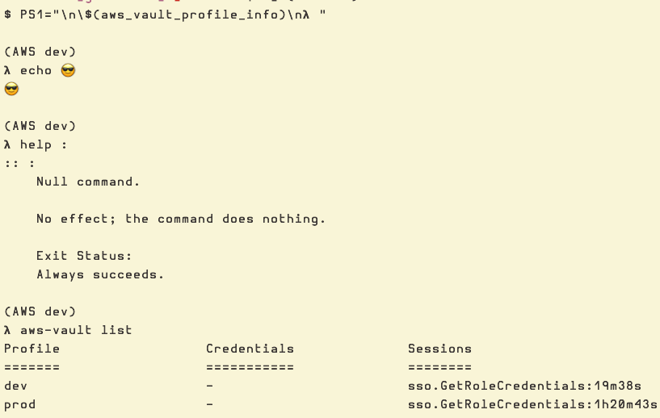
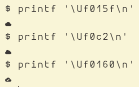
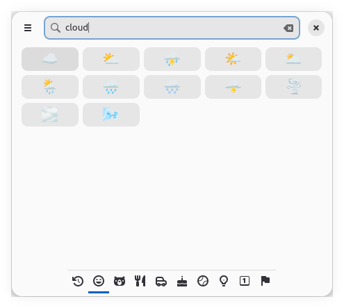

# AWS Vault Bash Prompt

## Introduction

The onboarding documentation for one of the projects I joined some time ago suggested the following setup:

1. Install oh-my-zsh.
2. Add the alias alias `av='aws-vault exec --debug --duration=1h'` to zsh's config files.

It works really well (zsh is amazing for interactive use, no denying that) and it shows the current active AWS profile in use for that shell session.
In this screenshot, I’m using the Spaceship theme with the lambda symbol “λ” (followed by a space) as the prompt character:



Yet, I still prefer to use Bash as my shell most of the time (and because it is the shell we use for almost 100% of shell scripts anyway).

Since my first steps in Unix-like systems (mostly Linux for me) I was always infatuated with the idea of crafting bash prompts that would suit particular needs in different projects and situations.
Maybe I’m working with Node.js, Ruby, Go, etc.
Check it out:



My prompt also shows a lot of Git information (new files, changed files, push/pull status, etc.), among other things I’m not covering or explaining in this post.

Anyway, how can we have Bash’s prompt to display aws-vault information?

## Adding aws-vault profile info to bash’s prompt

It so happens that when we authenticate to one of the configured AWS Vault profiles, aws-vault fills in some environment variables for the child subshell
that gets created, as described in their readme:

- [99designs/aws-vault README](https://github.com/99designs/aws-vault/blob/master/README.md#how-it-works).

For our purposes, we can make use of `AWS_VAULT` environment variable!
It works like this: if we log into the “dev” profile, that variable will contain the value “dev”.
Log into a profile like “stage” , and it will now contain the value “stage”, and so on and so forth for any other profiles.

:::{code} bash
:caption: Inspecting AWS_VAULT env var on bash
$ PS1='\$ '

$ aws-vault exec --duration=1h dev
$ echo $AWS_VAULT
dev

$ exit

$ aws-vault exec --duration=1h stage
$ echo $AWS_VAULT
stage
:::

:::{tip}
You might have your own bash setup with `.bashrc`, `.bash_profile` and maybe some other bash related files that are sourced from one or both of those two main files. That said, to get started with the next examples, adding the code to either `~/.bashrc` or `~/.bash_profile` should be fine.
:::

With that knowledge in mind, we can write a bash function similar to this one:

:::{code} bash
:caption: Bash function to display AWS Vault profile information
##
# Get aws-vault active profile session information.
#
# aws cli/vault sets the env var AWS_VAULT for the currently active
# profile session. Therefore, we just verify it is set with a
# non-empty value to decide if we display it in the prompt or not.
#
function aws_vault_profile_info () {
  if [[ -z $AWS_VAULT ]]
then
  return 0
fi
  printf '(AWS %s)' "$AWS_VAULT"
}
:::

Then we test our newly created function as our PS1 bash prompt, maybe like this:

:::{code} bash
:caption: Testing our new AWS Vault info function
$ PS1="\n\$(aws_vault_profile_info)\n𝝺 "
(AWS dev) 𝝺 echo 😎
😎

(AWS dev) 𝝺
:::



Or write a shell function that can be later called without having to memorize any of the bash’s prompt syntax:

:::{code} bash
ps1aws () {
    PS1="\n\$(aws_vault_profile_info)\n𝝺 "
}
:::

Then simply call `ps1aws` function from a bash session (and log into some AWS Vault profiles, of course).

:::{note}
Of course you can have your bash's PS1 prompt _always_ already include that function in `~/.bashrc`, for example.
:::

## Adding an icon ☁️

If text-only is too dull for you, it is possible can add an icon to the prompt as well.
Simply pick an icon from your favorite emoji picker, or use an hex escape sequence:

<!--
Somehow these unicode symbols render on the terminal, but not on mystmd or
Confluence in the web brwoser. Commenting it out for now and leaving  only
the screenshot until I have time to figure this out.

:::{code} bash
$ printf '\Uf015f\n'
󰅟
$ printf '\Uf0c2\n'

$ printf '\Uf0160\n'
󰅠
:::
-->



:::{tip}
You can install one or more Nerd Fonts and then look up the hex codes for the symbols you prefer in their website:

- [Nerd Fonts cheat-sheet](https://www.nerdfonts.com/cheat-sheet)

Set up your terminal to use the installed Nerd Font and then it we can also use one of those in the prompt:

:::{code} bash
function aws_vault_profile_info () {
    if [[ -z $AWS_VAULT ]]
    then
        return 0
    fi

    printf '(AWS %s \Uf0160)' "$AWS_VAULT"
    #                   \
    #                    \
    #           Add something like this.
}
:::

Or with the emoji copied from your emoji picker:

:::{code} bash
function aws_vault_profile_info () {
    if [[ -z $AWS_VAULT ]]
    then
        return 0
    fi

    printf '(AWS %s ☁️)' "$AWS_VAULT"
    #                \
    #                 \
    #        Add something like this.
}
:::

:::{note}
This is the [Smile emoji picker](https://github.com/mijorus/smile), on Arch Linux.


:::

In any case, depending on which symbol or emoji we have picked for our prompt, it could look like this:

```{figure} ../__assets/aws-dev-prompt-Uf0160-unicode.png
:alt: AWS prompt Nerd Font
:label: aws-prompt-nerd-font
:align: center

AWS prompt with Nerd Font
```

```{figure} ../__assets/aws-dev-prompt-clound-emoji-symbol.png
:alt: AWS prompt with cloud emoji
:label: aws-prompt-cloud-emoji
:align: center

AWS prompt with cloud emoji
```

In the end, it will look like this:

```{figure} ../__assets/bash-aws-vault-prompt.png
:alt: AWS Vault prompt in Bash
:label: aws-vault-prompt-in-bash
:align: center

AWS Vault prompt in Bash
```

Cool 😎, huh‽

## Conclusion

Check my dotfiles repo and my other bash prompt stuff if you want to see some more examples:

- [Bash prommpts on my dotfiles repository on Gitlab](https://gitlab.com/fernandobasso/dotfiles/-/blob/devel/bash_incl/bash-prompts.sh)
