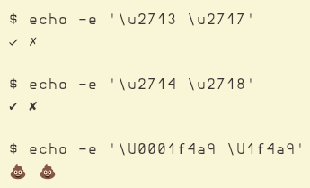
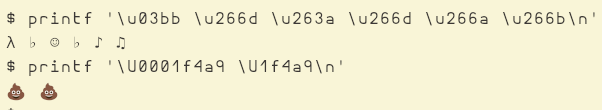

# Bash and Unicode

Bash (and sure, other shells as well) can work with Unicode just fine.
In this article, we'll explore some use cases and examples on the topic.

:::{note} Set your bash PS1 prompt
To follow along with thise examples, set your bash PS1 prompt to this:

```bash
PS1='$ '
```
:::

## echo

`echo` is a bash's built-in command, therefore, we can invoke `help echo` in a bash session:

```{code} text
:caption: Excerpt of `help echo`.
echo: echo [-neE] [arg ...]
    ...
      -e	enable interpretation of the following backslash escapes
    ...

    \uHHHH	the Unicode character whose value is the hexadecimal value HHHH.
          HHHH can be one to four hex digits.
    \UHHHHHHHH the Unicode character whose value is the hexadecimal value
          HHHHHHHH. HHHHHHHH can be one to eight hex digits.
    ...
```

Of importance for the topic of Unicode in this post is the combination of `-e` and the `\u...` and `\U...` backslashe escape sequences.

In short, we can use `-e` to enable `echo` to interpret `\u` and `\U`.
`\u` takes at most four hex digits, while `\U` can take up to eight` hex digits, thus allowing us to echo the full range of Unicode characters and symbols.

So once we know the unicode hex sequences, we can easily display them:

```{code} bash
$ echo -e '\u2713 \u2717'
✓ ✗

$ echo -e '\u2714 \u2718'
✔ ✘

$ echo -e '\U0001f4a9 \U1f4a9'
💩 💩
```

And heres a screenshot in case your OS/browser is not set up to use and display Nerd Fonts.



When using those backslash escape sequences, it is not necessary to type the leading zeroes, as the last command above illustrates.
That is, instead of having to type something like `0001f4a9`, it is possible to shorten it to `1f4a9`, which are the significant bits.

And just to be clear, we can echo any char, even the good old ASCII friends (which in UTF-8, have the same internal representation, so valid ASCII is also valid UTF-8).

```{code} bash
$ echo -e '\u41 \u5a \u61 \u7a'
A Z a z

$ echo -e '\ua0'
(prints a newline)
```

The last one prints a newline.
Check `man ascii` for some extra enlightenment.

## printf

`printf` is also a shell built-in.
Sadly, `help printf` only briefly mentions escape sequences, but it does not include details on that.
`man bash` also doesn't seem to document Unicode-related escape sequences either, unless it is in a place I missed looking at.

In any case, following the TIAS (try and and see) plus some web searches does give us some practical answers.
Basically, we can also use `\u` and `\U` with bash's `printf`:

```{code} bash
$ printf '\u03bb \u266d \u263a \u266d \u266a \u266b\n'
λ ♭ ☺ ♭ ♪ ♫
$ printf '\U0001f4a9 \U1f4a9\n'
💩 💩
```




## Final notes

Cool, huh‽ 😎.
