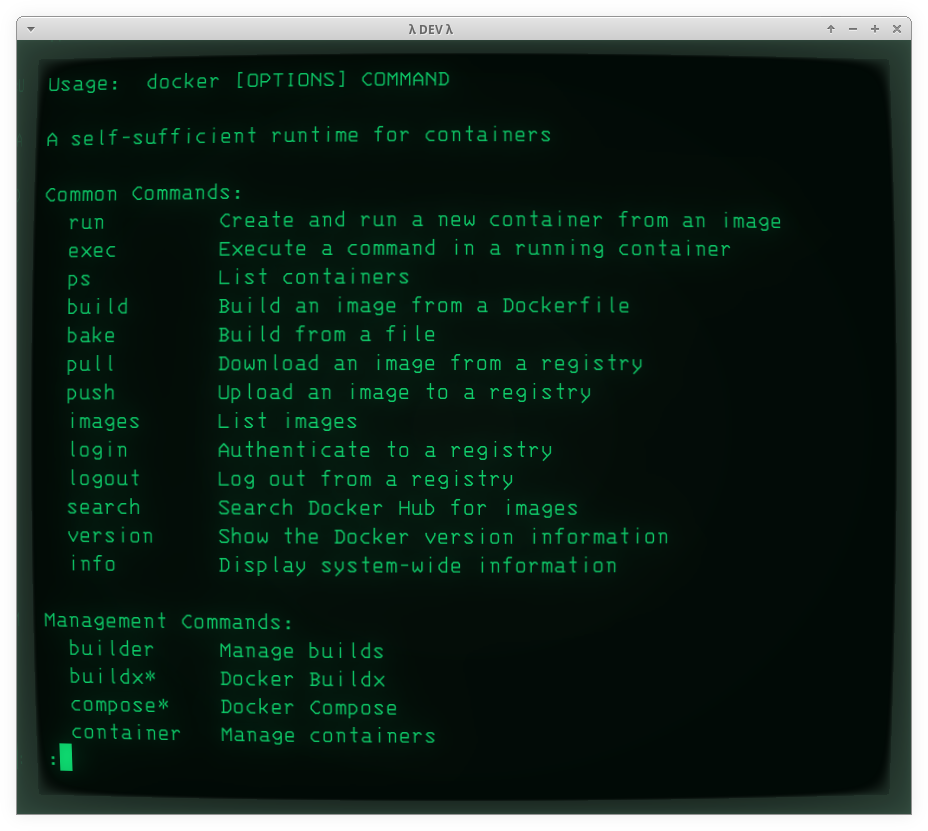

# Intro to Docker

## Requirements for learning Docker

To have a good grasping of working with Docker, it is essential that we have a solid understanding of Unix (most specifically Linux) operating system, command line tools and shells, networking and many other related topics.
Almost everything we do with Docker ends up needing that sort of knowledge and experience about many other things.

Moreover, understanding the tools we want to run in Docker is a must as well.
For example, to run a database like PostgreSQL in Docker, besides knowing Docker and Linux and whatnot (as mentioned above), knowing how PostgreSQL itself is supposed to be managed, configured, fine tuned, etc. is equally important.
Understanding of PostgreSQL roles, users, replication, etc. are all part of the deal.

In short, a lot of stuff has to be understood together.

That said, there is no problem in learning on demand as we figure out other things we may be still lacking more knowledge of.
We can research on topics as they become important or necessary on our daily routines.

Take a look at the Docker menu of the current list of Docker tutorials on this website.
