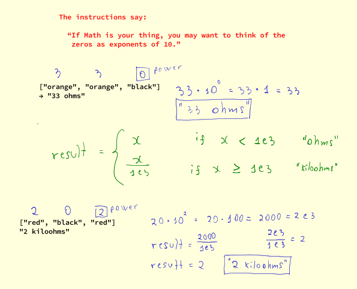

# Resistor Color Trio Exercism Challenge

- https://exercism.org/tracks/typescript/exercises/resistor-color-trio

## Math Power of 10 Explanation



## Unit Tests

```ts
--8<-- "src/exercism/typescript/resistor-color-trio/resistor-color-trio.spec.ts"
```

## v1 slice, map, join

```ts
--8<-- "src/exercism/typescript/resistor-color-trio/resistor-color-trio-v1.ts"
```

## v2 index of colors, extra variables

This solution uses the indexes of the colors as the values, so, instead
of an object with `color: num`, we simply have an array of colors.

It also uses a bunch of extra variables for intermediary results. The
downside is that it is too many.  On the bright side, their names may
help understanding the reasoning with the algorithm.

Also note that `band1` is in the ten's position, therefore, we multiply
it by 10. `band2` is in the one's position, and therefore we don't
multiply it (or multiply it by 1).

```ts
--8<-- "src/exercism/typescript/resistor-color-trio/resistor-color-trio-v2.ts"
```

## v3 less extra variables

This solution is similar to the previous one, except that instead of
creating all the extra varaible to store intermediary results and name
(making it more self-documenting) those results, we instead go with the
approach of doing the multiplaction and additions without the extra
variables. It may be harder to understand, perhaps, but at least it
reduces all those variables.

```ts
--8<-- "src/exercism/typescript/resistor-color-trio/resistor-color-trio-v3.ts"
```
