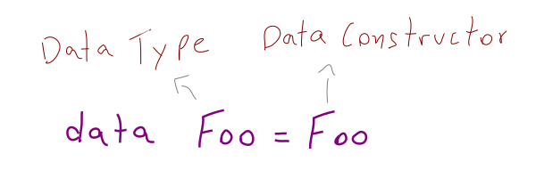

# Data Types

To create a new Data Type we use the `data` keyword:

```purs
data Foo = Foo

x :: Foo
x = Foo
```



The type `Foo` has one inhabitant, `Foo`.

We can use the same name on the left, as the Data Type, and on the right as the Data Constructor because they are stored in different namespaces.

## Product and Coproduct types

If some type can be either one or the other, but not both, it is a *coproduct* (sum type), also called *union* types. In Set Theory, an *union* operation is an “OR” operation.

The “hello world” of data types is defining our own version of true and false:

```purs
data Bool = T | F

f :: Bool
f = F

t :: Bool
t = T
```

`Bool` is the *data type* and `T` and `F` are the *data constructors*.

A given `v :: Bool` can be either `F` **or** `T` but not both at the same time. In Set Theory, a *union* is an *OR* operation, generally denoted by `|` or `||` in programming languages.

```purs
data ReasonToCancel
  = TooManyEmails
  | NotInterested
  | Other String

answer :: ReasonToCancel
answer = Other "I don't like email adds..."
```

The data constructor `Other` in `ReasonToCancel` data type is actually a function which implies:

```purs
Other :: String -> ReasonToCancel
```

That is, the “function” `Other` is a function from `String` to `ReasonToCancel`. It maps one type to another.

