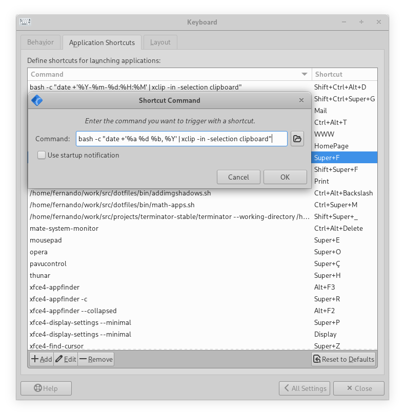

# Xfce Power Tips

## Paste current date and time

From time to time we want to paste date, or date and time into some document we are writing, or a source code comment, etc.

First, some useful `date` commands:

```text
$ date +'%a %d %b, %Y'
Sun 29 May, 2022

$ date +'%Y-%m-%d:%H:%M'
2022-05-29:11:25
```

We can pipe those to `xclip` or `xsel` to copy them to the clipboard (could copy them to the primary selection too so we could paste with mouse wheel button click):

```text
$ date +'%a %d %b, %Y' | xclip -in -selection clipboard
Sun 29 May, 2022

$ date +'%Y-%m-%d:%H:%M'
2022-05-29:11:25 | xclip -in -selection clipboard
```

Then, open Xfce4 Keyboard Settings (`xfce4-keyboard-settins` from the shell) or through the system preferences, and add the commands with the shortcuts:



I have `Ctrl+Alt+d` for date, and `Ctrl+Alt+Shift+d` for date with time.

