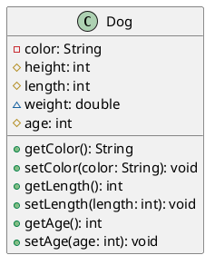

# Class Diagrams

https://www.youtube.com/watch?v=WnMQ8HlmeXc&t=579s

## Dog

```plantuml
@startuml
skinparam DefaultFontName Source Code Pro
skinparam DefaultFontSize 15

class Dog {
  -color: String
  #height: int
  #length: int
  ~weight: double
  #age: int

  +getColor(): String
  +setColor(color: String): void
  +getLength(): int
  +setLength(length: int): void
  +getAge(): int
  +setAge(age: int): void
}
@enduml
```

- Conceptual Perspective
- Specification Perspective
- Implementation Perspective

