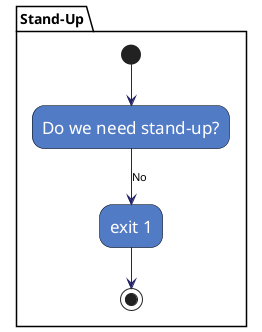

# Random Diagrams

```plantuml
@startuml
skinparam DefaultFontName Source Code Pro
skinparam DefaultFontSize 15

@startuml

skinparam activity {
  FontColor          white
  AttributeFontColor white
  FontSize           17
  AttributeFontSize  15
  AttributeFontname  Droid Sans Mono
  BackgroundColor    #527BC6
  BorderColor        black
  ArrowColor         #222266
}

partition Stand-Up {
(*) --> "Do we need stand-up?"
    -down-> [No] "exit 1"
    --> (*)
@enduml
```
