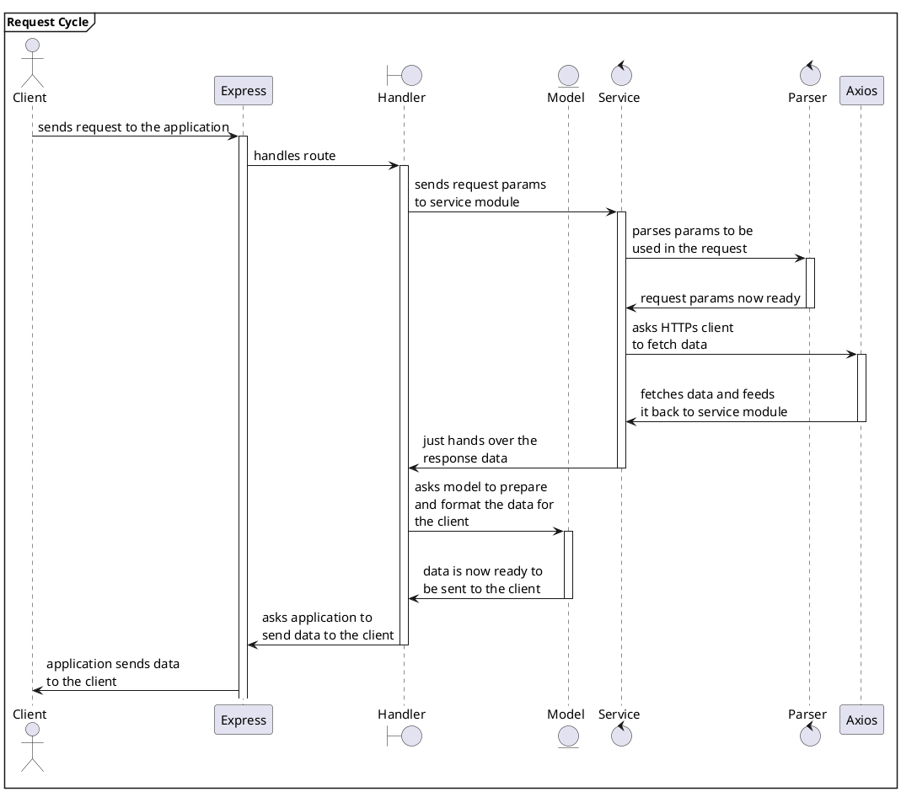

# Sequence Diagrams

## Express Application Request Cycle

```plantuml
@startuml
skinparam DefaultFontName Source Code Pro
skinparam DefaultFontSize 15
' hide footbox
mainframe **Request Cycle**

Actor Client

participant Express
boundary    Handler
entity      Model
control     Service
control     Parser
participant Axios

Client -> Express ++: sends request to the application

Express -> Handler ++: handles route

Handler -> Service ++: sends request params\nto service module

Service -> Parser ++: parses params to be\nused in the request
|||
Parser  -> Service --: request params now ready

Service -> Axios ++: asks HTTPs client\nto fetch data
|||
Axios   -> Service --: fetches data and feeds\nit back to service module

Service -> Handler --: just hands over the\nresponse data
Handler -> Model ++: asks model to prepare\nand format the data for\nthe client
|||
Model   -> Handler --: data is now ready to\nbe sent to the client

Handler -> Express --: asks application to\nsend data to the client
Express -> Client: application sends data\nto the client


@enduml
```
