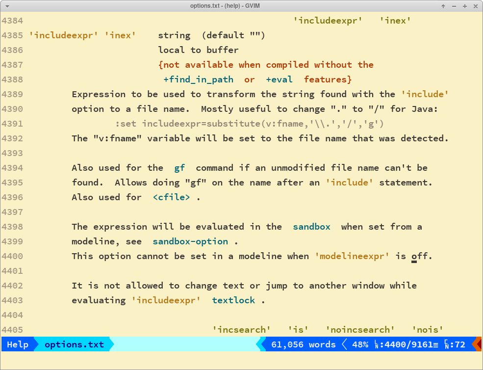

# Vim Gotchas

Perhaps these are not really gotchas. Perhaps one would be aware of them
given enough reading of the docs and experience. Still, these are things
I deem worthwhile to be written down.

## substitute() single vs double quotes

In most cases, we can use both single and double quotes in
vimL/vimscript.

These both work. Note we are using single quotes in the first example,
and double quotes in the second example.

```vim
echo substitute('master yoda', ' ', '-', '')
" → master-yoda

echo substitute("Ahsoka Tano", ' Tano', '', '')
" → Ahsoka
```

!!! note

    If you have these lines of code/examples in a buffer (doesn't even
    need to be a vimscript buffer), it is possible to run the examples
    without having to type them char by char.

    Start a vim command line (in normal mode, type `:`), then put the
    cursor on the echo lines and hit `Ctrl+r Ctrl+l Return` to run the
    above examples.

### When It Doesn't Work

However, when we use the `substitute` command in some situations where
where a expression is expected, there can be no spaces after `,`, and
single and double quotes behave differently.

One such case is with the `includeexpr` that is used to modify the path
`gf` is able to navigate to files in some situations.

Suppose with have a path to a file name like this (cursor is represented
by the “^” character:

```text
foo/bar/intro.md
          ^
```

And we want to make sure `gf` navigates to this this file/path instead:

```text
docs/foo/bar/intro.md
```

So, what we need is to modify `includeexpr` so that it prepends that
`docs/` prefix.

### First Attempt

We start with:

```vim title="first attempt"
set includeexpr=substitute(v:fname, '^', 'docs/', '')
```

And we get an error:

```text title="first attempt error"
E518: Unknown option: '^',
```

It thinks we are passing “'^',” as an option...

### Second Attempt

We try double quotes.

```vim title="second attempt"
set includeexpr=substitute(v:fname, "^", "docs/", "")
```

We don't get an error, but `includeexpr` is not correct:

```text title="result of the second attempt"
echo &includeexpr
" → substitute(v:fname,
```

It stored only part of our expression in `includeexpr`...

### What The Poop 💩‽

!!! error "The Problem"

    And as it turns out, the problem is that we can't have spaces
    between the parameters of the `substitute` expression when used with
    `includeexpr`.

### The Correct Syntax

We MUST use single quotes and refrain from leaving spaces between the
`substitute` parameters.

```vim title="correct syntax without spaces"
set includeexpr=substitute(v:fname,'^','docs/','')
" → substitute(v:fname,'^','docs/','')
```

The reason seems to be that `includeexpr` takes an expression, and it
must take, in this case, the entire substitute expression as a single
thing.

### Final Thoughts

If we take a look at `:help substitute()`, it doesn't seem to mention
anything about single vs double quotes or about the spaces (because it
doesn't matter for `substitute()` itself.

If we check `:help 'includeexpr'`, it doesn't not mention anything about
spaces, but it does have an example where we clearly see there is no
spaces between the arguments and it is indeed using single quotes.



I have observed that at times (not only in vim, but any technology),
something is possible but not documented, so you try stuff that seem to
make sense and it works. Other times, if it is not documented, it is
because it is not possible.

The rationale goes like this: what is possible is documented (for well
written, good documentation at least). It is impossible to document
every other impossible situation. Think about sets and complements. The
documented stuff is the possible stuff. The complement is all the rest
that is not possible, and these are generally not documented, with some
exceptions on special cases (like gotchas and things that are easy to
confused or lead to wrong assumptions).
