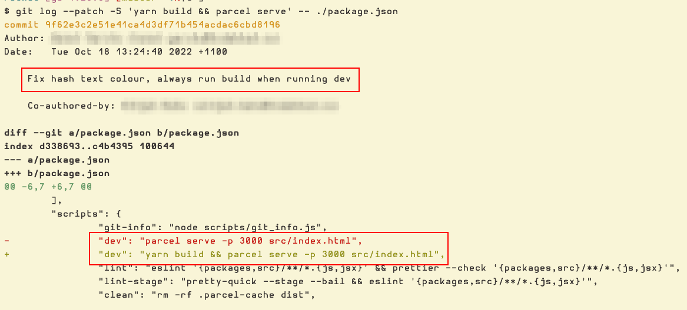

# Bad Git Commit Messages

## Real example 1

Recently, while working on a new project, we had this `dev` script in `package.json`:

```json
{
  "name": "project-x",
  "scripts": {
    "dev": "NODE_ENV=development yarn build && parcel serve -p 3000 src/index.html",
    "build": "parcel build src/index.html"
  }
}
```

First, I could not understand why, for development, our script first ran `build` followed by `parcel serve`.
Second, saving files in the project would not cause the files to be retranspiled.
We had to keep stoping and starting the local server again for the new changes to be picked up.

Then I read Parcel docs, and sure enough, just chaning the script to this worked fine:

```{code} json
:filename: package.json
{
  "dev": "NODE_ENV=development parcel serve -p 3000 src/index.html"
}
```

But then I decided to take a look at the history of those changes in `package.json`.
The commit message contained this:



**commit message subject**

```text
Fix hash text colour, always run build when running dev
```

And the diff:

```diff
- "dev": "parcel serve -p 3000 src/index.html",
+ "dev": "yarn build && parcel serve -p 3000 src/index.html",
```

So, it looks like the commit is doing two things:

* Fix some hash text color.
* Add a build step before starting the local server.

No idea about the first one.
What fix, or kind of fix exactly?

For the build step, I want to believe there was a good reason, but it is not given or explained in any way.
`parcel serve` will run a local developemnt server _in watch mode_ and that is all we should need.
If that was some how not enough, the commit message should have explained the problem and why that particular solution was selected.
It is hard (impossible) to understand why that build part was introduced.

That is a _very_ bad commit message.

We want to fix the local development setup, but we don’t know why the setup was changed to that approach in the first place.
The people involved with those changes are no longer around, and the best we can do is guess.

<style type="text/css" rel="stylesheet">
body {
  font-family: Ubuntu, 'Noto Sans', 'Open Sans', Helvetica, Arial;
}

.hljs-comment,
pre.pygments .tok-c1 {
  font-style: normal;
}
</style>
