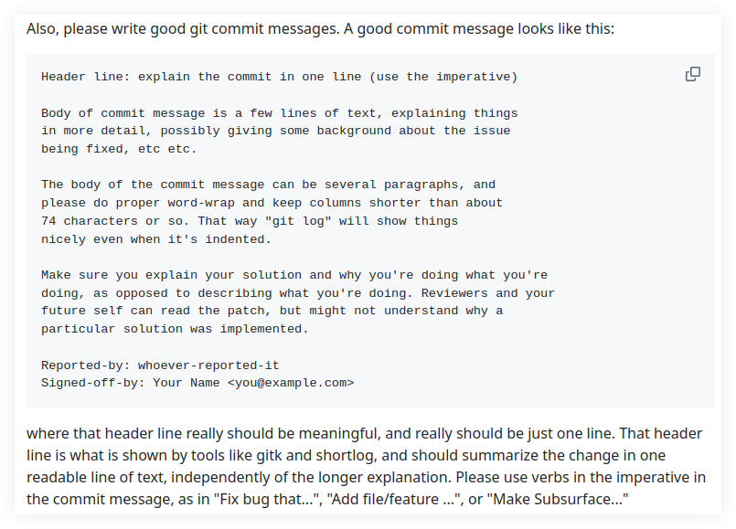

# Git Commit Messages

## Introduction

Commit messages matter.
One of the goals of any repository is to keep the project's history in good shape.

The main goals of following agreed upon (good) practices on a given project's repository amounts to these:

- Organized.
- Clean.
- Searchable.
- Informational.

Those three characteristics form a symbiosis that leads to **traceability**, which in turn helps pinpointing the cause of problems when things go wrong (and they do go wrong).

## One lamentable episode

Once upon a time, I was in the #git IRC channel at libera.chat (I am still active in IRC) and we were talking about the importance of proper commit messages when this happened (real nicks omitted):

``` 
user_0
Are there "official" git documentation on writing proper commit messages?
What I see is people random opinions in posts all over the web (some very
sensible, true). I have had little success educating people on writing an
informative and concise subject line followed (when appropriate) by some
explanation for the reason of that commit.

user_1
beyond that, it's up to the development team to implement

user_2
yeah, teams should decide what they want to do

user_0
People who do not understand and/or read about git and this kind of stuff
dislike even attempting to get good at it.

user_0
It is hard to explain, argue and have an educated conversation about a
subject with people who do not know about that subject. “Ignorance more
frequently begets confidence than does knowledge.” I see that all the
time. I hope I myself don't do it as much as I seem to watch other people
doing it...

user_2
if proper commit messages have no purpose other than being proper commit
messages.. they're a waste of time

user_2
user_0: which problem are you actually trying to solve?

user_0
user_2: I am trying to convince people that commit messages matter. That
keeping a repo organized, clean, informational, semantic, etc. helps. Helps
troubleshooting problems, finding historical stuff, and makes everyone
happier.  user_2: Then commit messages could be like "first commit", "second
commit".

user_0
Sure. I add to that that just because you are linking to a ticketing
system doesn't relive people for being responsible in writing good code
and commit subject and description in general.

→ Then someone asks this question ←

user_3
There is a Git repo where the contents of .gitattributes file is
"* java eol=lf" ... is that correct?

→ nobody answers, the same person insists ←

user_3
perhaps the line should be "*.java eol=lf" instead of "* java eol=lf"?

user_4
user_3: I think attributes can be free-form (ie. there's no finite
list of legal attributes). So in theory it looks like it sets the "java"
attribute on all files
user_3: try  git check-attr -a some/file
yep. man gitattributes "DEFINING MACRO ATTRIBUTES"

user_3
user_4, is "java" even a real attribute? I'm reading the documentation for
gitattributes and it seems maybe "java" can be a "built-in pattern", but
not an attribute

user_4
user_3: it's an attribute that someone made up

user_4
But whatever that attribute does, it sure sounds weird to put in on all
files. So I would still guess it's a typo

user_3
user_4, okay... I think one of two fixes will work. Either remove the
asterisk and let "java" be the first thing on the line which makes it
the built-in pattern... or putting a dot between * and java which makes
"*.java" the pattern

user_4
maybe the commit message has a clue

user_0
Good idea. Do a git log -S java -- .gitattributes

user_3
user_0, yeah, I saw where they added it. It was on a commit
called "spotless applied" whatever that is... I'm not a Java person

user_0
user_3: And no extra description on the commit?

user_3´
user_0, was a big commit... looks like they applied some auto
style formatting

user_4
I guess it's a typo. I'm just saying it's technically legal the way it
is.

user_5
user_2: here's an example where proper commit message and usage of the
tool would be invaluable

user_0
I will print this conversation. It may help my future arguments with
people.

user_2
user_5: you don't need to convince me
```

TL;DR: Someone was struggling understanding something in the repository, and there had been a massive commit with lots of files which went through some tool to format them, and the only thing the commit message said was “spotless applied”.

But they did more than “apply the spotless thing.”
They had changed the `.gitattributes` file with some strange stuff (or it was a typo, god knows) and nothing in the commit message to give a clue.
I'll refrain myself from showing here a few other scenarios that I have been through at work lest I get in trouble with my current or previous employers.
The list of situations like this goes on.

Read the Chris Beans post (linked below) and the others as well.

TODO: We intend to add our own examples where regarding commit messages, atomic commits, squashing commits (when it makes sense, not all the time), etc.

## Linus Torvalds

### Use the imperative, Luke

> From: Linus Torvalds &lt;torvalds@linux-foundation.org>
> To: Linux Kernel Mailing List &lt;linux-kernel@vger.kernel.org>
> Subject: Linux 6.12-rc2
> Date: Sun, 6 Oct 2024 16:28:36 -0700	[thread overview]
> Message-ID: &lt;CAHk-=wgMS-TBfirwuxf+oFA3cTMWVLik=w+mA5KdT9dAvcvhTA@mail.gmail.com> (raw)
>
> Hmm. I have had this mental picture that usually rc2 tends to be one
> of the smaller rc’s because people take a breather after the merge
> window, and/or because it takes a while before people start finding
> issues.
>
> But at least this release doesn’t seem to show that pattern, and I
> went back and did some stats on older 6.x releases, and from a quick
> look it looks like it’s really only true about half the time. Some
> rc2’s are indeed fairly small, but not all are. I guess I should have
> run the numbers before.
>
> Anyway, this isn’t one of the small rc2’s. But looking at historical
> trends, being a bigger rc2 isn’t _that_ unusual, and nothing in here
> looks all that odd. Yes, the diffstat may look a bit unusual, in that
> we had a global header renaming (asm/unaligned.h -> linux/unaligned.h)
> and we had a couple of reverts that stand out as spikes in the stats,
> but everything else looks nice and small. In fact, one other
> noticeably bigger spike in the diffstat is just due to some folio
> documentation updates, not any code changes.
>
> At about a quarter of the diffs, the filesystem changes are a bit
> bigger than usual (and would actually have been bigger than the driver
> changes if it wasn’t for one of those reverts), but that’s probably
> just a random timing effect. I expect I’ll be getting more driver
> updates next week.
>
> Anyway, on a completely different note: I try to make my merge commit
> messages be somewhat "cohesive", and so I often edit the pull request
> language to match a more standard layout and language. It’s not a big
> deal, and often it’s literally just about whitespace so that we don’t
> have fifteen different indentation models and bullet syntaxes. I
> generally do it as I read through the text anyway, so it’s not like it
> makes extra work for me.
>
> But what **does** make extra work is when some maintainers use passive
> voice, and then I try to actively rewrite the explanation (or,
> admittedly, sometimes I just decide I don’t care quite enough about
> trying to make the messages sound the same).
>
> So I would ask maintainers to please use active voice, and preferably
> just imperative.
>
> Put another way: I’d love it if people would avoid writing their
> descriptions as "In this pull request, the Xyzzy driver error handling
> was fixed to avoid a NULL pointer dereference".
>
> Instead write it as "This fixes a NULL pointer dereference in .." or
> particularly if you just list bullet points, make the bullet point
> just be "Fix NULL pointer dereference in ..".
>
> This is not a big deal, I realize. But I happened to try to rewrite a
> few of these cases the last week, and I think simple and to-the-point
> language is better. The imperative version of just "Fix X" is about as
> clear as it gets.
>
> Linus
>
> — Linus Torvalds

Source: [Linux Kernel Mailing List message](++https://lore.kernel.org/lkml/CAHk-=wgMS-TBfirwuxf+oFA3cTMWVLik=w+mA5KdT9dAvcvhTA@mail.gmail.com/++).

### Subsurface contributing notes



> Also, please write good git commit messages. A good commit message looks like this:
>
> ```text
> Header line: explain the commit in one line (use the imperative)
>
> Body of commit message is a few lines of text, explaining things
> in more detail, possibly giving some background about the issue
> being fixed, etc etc.
>
> The body of the commit message can be several paragraphs, and
> please do proper word-wrap and keep columns shorter than about
> 74 characters or so. That way "git log" will show things
> nicely even when it's indented.
>
> Make sure you explain your solution and why you're doing what you're
> doing, as opposed to describing what you're doing. Reviewers and your
> future self can read the patch, but might not understand why a
> particular solution was implemented.
>
> Reported-by: whoever-reported-it
> Signed-off-by: Your Name <you@example.com>
> ```
>
> where that header line really should be meaningful, and really should be just one line. That header line is what is shown by tools like gitk and shortlog, and should summarize the change in one readable line of text, independently of the longer explanation. Please use verbs in the imperative in the commit message, as in "Fix bug that...", "Add file/feature ...", or "Make Subsurface..."
>
> — Linus Torvalds

Source: [Subsurface contributing guidelines](https://github.com/torvalds/subsurface-for-dirk/blob/master/README.md#contributing).

## References

- [Chris Beans award-winning post about commit messages](https://cbea.ms/git-commit/).
- [Linus Torvalds on commit messages](https://github.com/torvalds/subsurface-for-dirk/blob/a48494d2fbed58c751e9b7e8fbff88582f9b2d02/README#L88).
- [Tim Pope post commit messages](https://tbaggery.com/2008/04/19/a-note-about-git-commit-messages.html).
- [Pro Git book on commit guidelines](https://www.git-scm.com/book/en/v2/Distributed-Git-Contributing-to-a-Project#_commit_guidelines).
- [Peter Hutterer, X Input hacker](http://who-t.blogspot.com/2009/12/on-commit-messages.html).
