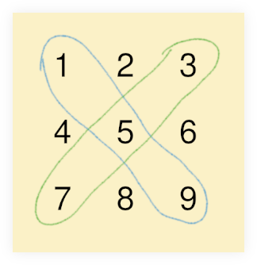

# Diagonal Difference

- [Diagonal Difference on HackerRank](https://www.hackerrank.com/challenges/diagonal-difference)

This is a classic matrix problem.
The “diagonal difference” is just the easy part (a subtraction).
The main challenge here is to sum the diagonals of the given square matrix.

```text

1     2     3

4     5     6

7     8     9
```



Basically, our goal is to sum 1, 5 and 9 from the right to left diagonal, 3, 5 and 7 from the left to right diagonal, and perform the subtraction.

## JavaScript

### Solution 1 with nested loops

```javascript
/**
 * Calculates the diagonal difference of the square matrix.
 *
 * T.C: O(n²).
 * S.C: O(1).
 *
 * @sig [Number] -> Number
 */
function diagDiff(sqrMatrix) {
  const len = sqrMatrix.length;
  let ltrDiag = 0;
  let rtlDiag = 0;

  for (let i = 0; i < len; i++) {
    for (let j = 0; j < len; j++) {
      if (i === j)
        ltrDiag += sqrMatrix[i][j];

      if (i + j === len - 1)
        rtlDiag += sqrMatrix[i][j];
    }
  }

  return Math.abs(ltrDiag - rtlDiag);
};
```

The time complexity is $O(n^2)$ because of the nested looping.

### Solution 2 with single loop

```javascript
/**
 * Calculates the diagonal difference of the square matrix.
 *
 * - T.C: O(n).
 * - S.C: O(1).
 *
 * @sig [Number] -> Number
 */
function diagDiff(xs) {
  let ltrDiag = 0;
  let rtlDiag = 0;
  let len = xs.length;

  for (let i = 0; i < len; ++i) {
    ltrDiag += xs[i][i];
    rtlDiag += xs[i][len - i - 1];
  }

  return Math.abs(ltrDiag - rtlDiag);
}
```

With this implementation, the time complexity is $O(n)$ (not $O(n²)$ like in the previous solution) because the sum of the left and right diagonals are calculated within the **same** loop.

A combination of `i` and `len` is used so that indices are accessed from the left _and_ right at the same time.
Because of `len - i`, each time `i` is incremented by the loop, that `len - i` produces lower and lower indexes each time.

That `len - 1 - 1` can be simplified a little bit:

```diff
/**
 * Calculates the diagonal difference of the square matrix.
 *
 * - T.C: O(n).
 * - S.C: O(1).
 *
 * @sig [Number] -> Number
 */
function diagDiff(xs) {
  let ltrDiag = 0;
  let rtlDiag = 0;
-  let len = xs.length;
+  const lastPos = xs.length - 1;

  for (let i = 0; i < len; ++i) {
    ltrDiag += xs[i][i];
-    rtlDiag += xs[i][len - i - 1];
+    rtlDiag += xs[i][lastPos - i];
  }

  return Math.abs(ltrDiag - rtlDiag);
}
```
