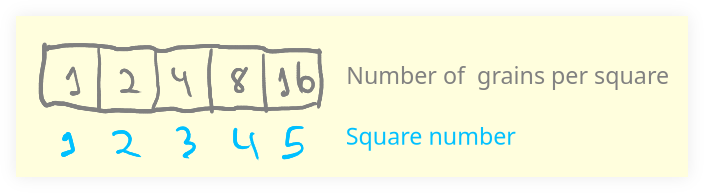
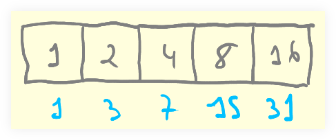

# Grains

- [Grains Lisp Exercise](https://exercism.org/tracks/common-lisp/exercises/grains)

## v1 non-optmized recursion loop

This solution uses a more traditional approach of looping over each square and accumulating the previous values.

The solution for `total` is exactly the same as the one for `square`, except it just adds one more accumulator for the total sum of the grains on the entire board.

### Time complexity

$O(n)$, as we iterate over each square in the board once.

### Space complexity

$O(1)$, as we simply use one or two integer accumulators to hold the values we need to compute.

```{code} lisp
(defparameter *board-size* 64)

;;;;
;; square :: Integer -> Integer
;;
;; Returns the amount of grains on a given square.
;;
(defun square (n)
  (labels
    ((run (i acc)
       (if (= i n)
         acc
         (run
           (+ i 1)
           (* acc 2)))))
    (run 1 1)))

;;;;
;; total :: Integer
;;
;; Returns the total number of grains on a board of *board-size* squares.
;;
(defun total ()
  (labels
    ((run (i acc sum)
       (if (= i *board-size*)
         sum
         (run
           (+ i 1)
           (* acc 2)
           (+ sum (* acc 2))))))
    (run 1 1 1)))
```

## v2 with base 2 powers

Did you notice that the number of grains on the board squares are 1, 2, 4, 8, 16, 32..., are all powers of 2?

Let's consider a board of 5 squares:



The blue indexes are the square number.
Notice how how if we use 2 as the base, and raise that base to each of the boards's square number minus 1, we get the number of grains on that specific square?

- $2 ^ 1 - 1 = 1$
- $2 ^ 2 - 1 = 2$
- $2 ^ 3 - 1 = 4$
- $2 ^ 4 - 1 = 8$
- $2 ^ 5 - 1 = 16$

So we could write `square` like this:

```{code} lisp
(defun square (n)
  (expt 2 (- n 1)))
```

And for the `total` grains on the whole square, consider this:

- $2 ^ 1 = 2$
- $2 ^ 2 = 4$
- $2 ^ 3 = 8$
- $2 ^ 4 = 16$
- $2 ^ 5 = 32$

And then compare with the sum from each adjacent square:



Notice each square sum with the previous number of grains on the previous squares is just 1 less than the powers from $2 ^ 1$ to $2 ^ n$.

Therefore, we can implement a solution like this for `total` (for a board of 5 squares):

```{code} lisp
(defun total ()
  (- (expt 2 5) 1))
```

Finally and from the explanations above, we can have the full solution for the challenge.

### Time complexity

$O(1)$ since we don't loop any longer and perform the whole computation with a couple of math operations.

### Space complexity

$O(1) since we simply return the result the computation without requireing any temporary memory space.

```{code} lisp
(defparameter *board-size* 64)

;;;;
;; square :: Integer -> Integer
;;
;; Returns the amount of grains on a given square.
;;
(defun square (n)
  (expt 2 (- n 1)))

;;;;
;; total :: Integer
;;
;; Returns the total number of grains on a board of *board-size* squares.
;;
(defun total ()
  (- (expt 2 *board-size*) 1))
```

