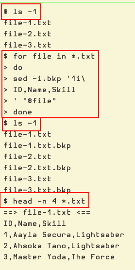

# Insert Lines With Sed

## Intro

Some of these examples and solutions are from real situations at work where I had to perform some surgery on one or more files to help automate some processes.
What I do is to simplify the examples to have smaller and less files so it is easier to visualize and get the idea.

Tested on GNU Sed and MacOS sed.

## Add a header to multiple .csv files

Consider several files containing content similar to this:

```{code} text
:caption: Sample CSV content
1,Aayla Secura,Lightsaber
2,Ahsoka Tano,Lightsaber
3,Master Yoda,The Force
...
```

And then we want to insert a CSV header "ID,Name,Skill" row to all the files.

To achieve it, we can use the `-i` option to replace _in place_, and the `1i` address + + command to _insert_ a line at line 1.

For this example, let's suppose we have three such files:

```
$ ls -1
file-1.txt
file-2.txt
file-3.txt
```

Then we look over each `.txt` file and apply our desired sed command to each of them:

```{code} text
:caption: Run the sed command on the files
$ for file in *.txt
> do
> sed -i.bkp '1i\
> ID,Name,Skill
> ' "$file"
> done
```

The sed command uses `-i.bkp` so we save a `.bkp` file for each file we are processing (in case we mess up and need to restore the original file before trying again).

Then, the sed script itself starts with a single quote followed by `1i\`.
We need to say, “at the address 1 (line 1), apply the _insert_ command”.
Then we add a `\` (backslash) and press {kbd}`Enter`.
The backslash **must be followed by a newline**.
Then on the next line we type the content we want for the header and press {kbd}`Enter` again.
Finally, close the single quote and provide the current file of the loop.

If we list the files again, we have three `.txt.bkp` files.
One for each of the original `.txt` file:

```{code} text
$ ls -1
file-1.txt
file-1.txt.bkp
file-2.txt
file-2.txt.bkp
file-3.txt
file-3.txt.bkp
```

Finally, if we inspect the files, they should show the first line now contains our header row:

```{code} text
$ head -n 4 *.txt
==> file-1.txt <==
ID,Name,Skill
1,Aayla Secura,Lightsaber
2,Ahsoka Tano,Lightsaber
3,Master Yoda,The Force

... same for the other files
```


