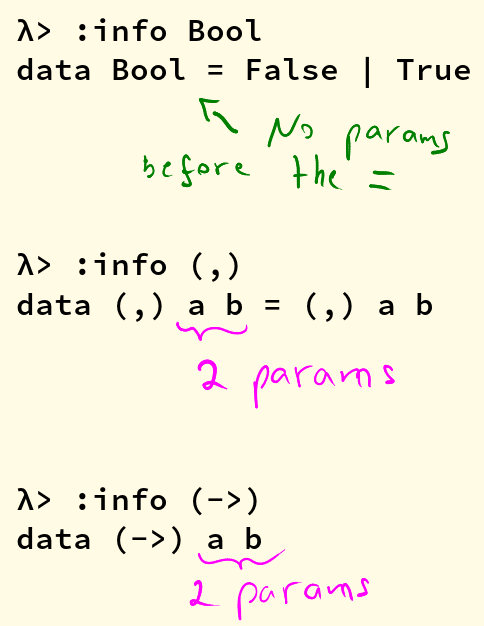

# Types - Chapter 05

<!-- vim-markdown-toc GitLab -->

* [What are types for?](#what-are-types-for)
* [How to read type signatures](#how-to-read-type-signatures)
  * [Understanding the function type (->)](#understanding-the-function-type-)
  * [Typeclass-constrained type variables](#typeclass-constrained-type-variables)
  * [Question about associativity left and right](#question-about-associativity-left-and-right)
* [Currying](#currying)
  * [Partial Application](#partial-application)
  * [Manual currying and uncurrying](#manual-currying-and-uncurrying)
  * [Currying and uncurrying existing functions](#currying-and-uncurrying-existing-functions)
  * [Sectioning](#sectioning)
  * [Exercises](#exercises)
    * [Exercise 1](#exercise-1)
    * [Exercise 2](#exercise-2)
    * [Exercise 3](#exercise-3)
    * [Exercise 4](#exercise-4)
    * [Exercise 5](#exercise-5)
    * [Exercise 6](#exercise-6)
    * [Exercise 7](#exercise-7)
    * [Exercise 8](#exercise-8)
    * [Exercise 9](#exercise-9)
* [Polymorphism](#polymorphism)
  * [Polymorphic constants](#polymorphic-constants)
  * [Question about fromIntegral](#question-about-fromintegral)
* [Type Inference](#type-inference)
* [Asserting types for declarations](#asserting-types-for-declarations)
* [Questions](#questions)
  * [Polymorphism](#polymorphism-1)
  * [Polymorphism](#polymorphism-2)
  * [Type Inference](#type-inference-1)
  * [Principal Type](#principal-type)
  * [Principal Type](#principal-type-1)
  * [Principal Type](#principal-type-2)
  * [Type Variable](#type-variable)
  * [Kind of polymorphism variable](#kind-of-polymorphism-variable)
  * [Typeclass](#typeclass)
  * [Parametricity](#parametricity)
  * [More questions](#more-questions)
* [The End](#the-end)
* [Exercises: Type Matching](#exercises-type-matching)
  * [01 functions](#01-functions)
* [Exercises: Type Arguments](#exercises-type-arguments)
  * [01 type of  f x](#01-type-of-f-x)
  * [02 type of g 0 'c'](#02-type-of-g-0-c)
  * [03 type of h 1.0 2](#03-type-of-h-10-2)
  * [04 type of h 1 (5.5 :: Double)](#04-type-of-h-1-55-double)
  * [05 jackal](#05-jackal)
  * [06 jackal](#06-jackal)
  * [07 kessel](#07-kessel)
  * [08 kessel](#08-kessel)
  * [09 kessel](#09-kessel)
* [Exercises: Parametricity](#exercises-parametricity)
  * [01 id](#01-id)
  * [02 a -> a -> a](#02-a-a-a)
  * [03 a -> b -> b](#03-a-b-b)
* [Exercises: Apply Yourself](#exercises-apply-yourself)
  * [01 (++)](#01-)
  * [02 (/)](#02-)
  * [03 take](#03-take)
  * [04 >](#04-)
  * [05 <](#05-)
* [Chapter Exercises](#chapter-exercises)
  * [Multiple choice](#multiple-choice)
    * [01 type of [a]](#01-type-of-a)
    * [02 type [[a]] -> [a]](#02-type-a-a)
    * [03 type [a] -> Int -> a](#03-type-a-int-a)
    * [04 type (a, b) -> a](#04-type-a-b-a)
  * [Determine the type](#determine-the-type)
    * [01 values and types returned](#01-values-and-types-returned)
    * [02 type of w](#02-type-of-w)
    * [03 type of z](#03-type-of-z)
    * [04 type of f](#04-type-of-f)
    * [05 type of f ++](#05-type-of-f-)
  * [Does it compile?](#does-it-compile)
    * [01 bigNum wahoo](#01-bignum-wahoo)
    * [02 print](#02-print)
    * [03 (+) function](#03-function)
    * [04 scope and order of evaluation](#04-scope-and-order-of-evaluation)
  * [Type variable or specific type constructor?](#type-variable-or-specific-type-constructor)
    * [01 Num a b Int](#01-num-a-b-int)
    * [02 zed blah](#02-zed-blah)
    * [03 Enum a b C](#03-enum-a-b-c)
    * [04 f g C](#04-f-g-c)
  * [Write a type signature](#write-a-type-signature)
    * [01 fnH](#01-fnh)
    * [02 fnC](#02-fnc)
    * [04 fnS](#04-fns)
  * [Given a type, write a function](#given-a-type-write-a-function)
    * [01 id](#01-id-1)
    * [02 first](#02-first)
    * [03 alpha equiv](#03-alpha-equiv)
    * [04 snd](#04-snd)
    * [05 reverse, tail](#05-reverse-tail)
    * [06 aToB aToC](#06-atob-atoc)
    * [07 ignore fn param](#07-ignore-fn-param)
    * [08 aToB](#08-atob)
  * [Fix it](#fix-it)
    * [04 module Sing](#04-module-sing)
    * [02 change song](#02-change-song)
    * [03 arith broken](#03-arith-broken)
  * [Type-Kwon-Do](#type-kwon-do)
    * [01 int to str to char](#01-int-to-str-to-char)
    * [02 A to B to C](#02-a-to-b-to-c)
    * [03 xform, X to Y to Z](#03-xform-x-to-y-to-z)
    * [04 munge](#04-munge)

<!-- vim-markdown-toc -->

## Anki Tags

* hffp (short  for Haskell From First Principles)
* ch05 (short for Chapter 05)


## What are types for?

System F in 1970s → Haskell (recursion, Hindley-Milner type inference.

Type systems in logic and mathematics have been designed to impose constraints that enforce correctness. Well designed type systems help to eliminate some classes of errros.

The `Bool` type has two inhabitants, `True` and `False`. When a type `Bool` is declared in type signature, the compiler will only accept one of those two values, and when one of those two values appear in the code, the compiler knows they are from the `Bool` type.

In Haskell, where typing is static, type checking occurs at compile time.

Statically typed languages allow optimizations because the compiler can predict certain things based on the type.


## How to read type signatures

Can query types for functions, partially-applied functions, and values.

`:type 1` displays typeclass information rather than information of a concrete type. The compiler doesn't know and doesn't need to infer a specific type until it is forced to do so.

```
λ> :type 1
1 :: Num p => p
```

Explicitly tell the compiler the type:

```
λ> n = 1 :: Double
λ> :type n
n :: Double
```

We can query the type of values, expressions and functions:

```
λ> :type (+)
(+) :: Num a => a -> a -> a
λ> :type (+ 1)
(+ 1) :: Num a => a -> a
λ> :type (1 + 1)
(1 + 1) :: Num a => a

λ> :type (1 + 1) / 4
(1 + 1) / 4 :: Fractional a => a
λ> :type (1 + 1) / 4 :: Double
(1 + 1) / 4 :: Double :: Double
```

Typeclasses are not types.

λ> n = 1 :: Fractional
...error...

Must use concrete type of the `Fractional` typeclass.

```
λ> n = 1 :: Float
λ> :type n
n :: Float

λ> :info Fractional
class Num a => Fractional a where
  (/) :: a -> a -> a
  recip :: a -> a
  fromRational :: Rational -> a
  {-# MINIMAL fromRational, (recip | (/)) #-}
		-- Defined in ‘GHC.Real’
instance Fractional Float -- Defined in ‘GHC.Float’
instance Fractional Double -- Defined in ‘GHC.Float’
```

So, both `Float` and `Double` have instances of the `Fractional` typeclass.

### Understanding the function type (->)
The arrow `(->)` is the type constructor for functions. It is a type constructor like `Bool`, except `(->)` takes arguments and has no data constructors.

REMEMBER: parens in type signatures just imply grouping, not precedence.

```
λ> :info Bool
data Bool = False | True

λ> :info (->)
data (->) (a :: TYPE q) (b :: TYPE r)
infixr 0 (->)

λ> :info (,)
data (,) a b = (,) a b
```

Note how a tuple type constructor takes params (‘a’ and ‘b’ before the `=`), and how the function type cunstructor takes two arguments too: `(a :: TYPE q)` and `(b :: TYPE r)`. (ℹ️  the output of the `:type`, `:info` and other commands may change across different GHCi implementations).

* [question on discord](https://discord.com/channels/280033776820813825/505367988166197268/849333471440797726)



**The value that shows up at term level is the function. Functions are values.**

A function is a value/expression that it can be applied, and the structure of the type demonstrates this. The arrow is an infix operator that has two parameters and associates to the right (although function application is left associative).

**The arrow is an *infix operator* that has two parameters and associates to the right (but function application is left associative).**


### Typeclass-constrained type variables

```
λ> :type (+)
(+) :: Num a => a -> a -> a

λ> :type (/)
(/) :: Fractional a => a -> a -> a
```

`+` can add together ints, doubles, etc., so, GHCi gives the most possible generic polymorphic type possible instead of limiting the function to handle only ‘Int’ or only ‘Double’ for instance. No, we get a typeclass-constrained polymorphic type variable.

Each type class offers a standard set of functions that can be used across several concrete types.

So, if a variable is typeclass-constrained with `Num a`, we can get a list of concrete types that have an instance of `Num`:

```
λ> :info Num
type Num :: * -> Constraint
class Num a where
  (+) :: a -> a -> a
  (-) :: a -> a -> a
  (*) :: a -> a -> a
  negate :: a -> a
  abs :: a -> a
  signum :: a -> a
  fromInteger :: Integer -> a
  {-# MINIMAL (+), (*), abs, signum, fromInteger, (negate | (-)) #-}
  	-- Defined in ‘GHC.Num’
instance Num Word -- Defined in ‘GHC.Num’
instance Num Integer -- Defined in ‘GHC.Num’
instance Num Int -- Defined in ‘GHC.Num’
instance Num Float -- Defined in ‘GHC.Float’
instance Num Double -- Defined in ‘GHC.Float’
```

We say it’s constrained because we still don’t know the concrete type of a, but we do know it can only be one of the types that has the required type class instance.

We can create a more specific/concrete type from a more polymorphic one, but not the other way rround:

```
λ> n = 1
λ> i = n :: Int
λ> d = n :: Double

λ> :type n
n :: Num p => p

λ> :type i
i :: Int

λ> :type d
d :: Double

λ> d + n
2.0

λ> d + i
...error...
```

The error is because `i` is no longer polymorphic. After GHCi evaluates `d` which is a `Double`, the `+` function requires that the other parameter is also a `Double`. In `d + n` it works because `n` is polymorphic `Num` typeclass and can be inferred to be `Double` concrete type, but `i` is `Int`, a concrete type, not a polymorphic type, so, it cannot be converted to `Double` which is required to match the first argument `d` and thus the error. In short, we can't do `d + i` because they are not polymorphic and their concrete types are different so they have different definitions on how to do addition.

Multiple typeclass constraints:

 ````
 (Ord a, Num a) => a -> a -> Ordering
 ````

One typeclass constraint for each variable:

```
(Num a, Num b) => a -> b -> b
```

Both constraints on the same variable `a`’:

```
(Ord a, Num a) => a -> a -> Ordering
```

Nothing to the left of the typeclass arrow ‘=>’ shows up at the term level. The tuple of constraints _does_ represent a product, or conjunction of constraints.


### Question about associativity left and right
[DATETIME: Mon, 2020-01-27 11:04]

Thanks to #haskell-beginners@merijn (again) ☺

THE ARROW ASSOCIATES TO THE RIGHT, BUT APPLICATION IS LEFT-ASSOCIATIVE.

REMEMBER: parens in type signatures just imply grouping, not precedence.

So "f x y z" == "(((f x) y) z)"

But "a -> b -> c -> d" == "a -> (b -> (c -> d))"

So applying a function to an 'a' returns a new function (consuming the remaining arguments)

ME: "a -> (b -> (c -> d))" looks like it should apply like "f (x (y z)))".

Consider this: If you apply 'f' to an 'a' then what's left?
A function that still needs a 'b' and a 'c'
But with "f (x (y z))" 'f' only ever gets one argument
Which is "x (y z)"

@TODO
Does the right-associativeness of ‘(->)’ in the type signatures just mean the function will take on param at a time, from _left_ to right, providing the currying thing‽

REMEMBER: parens in type signatures just imply grouping, not precedence.

Currying
--------
[DATETIME: Mon, 2020-01-27 14:16]

It looks like functions take multiple arguments in Haskell, but the truth is that we have a chain of nested functions: all functions in Haskell take one argument and return one result. When a function appear to take multiple functions, in truth, it takes one argument and returns another function that takes the next argument, and so on until all the arguments have been consumed and the final result is produced.

Each arrow `(->)`in a type signature represents one argument and one result, with the final type being the final result.

```
data (->) a b
```

In `(+) :: Num a => a -> a -> a’, the ‘a -> a -> a` represent successive function applications.

The way the type constructor for functions, `(->)`, is defined makes currying the default in Haskell. This is because it is an infix operator and right associative. Because it associates to the right, types are implicitly parenthesized like so:

```
f :: a -> a -> a
```

is the same as 

```
f :: a -> (a -> a)
```

and

```
map :: (a -> b) -> [a] -> [b]
```

is the same as

```
map :: (a -> b) -> ([a] -> [b])
```

The association here, or grouping into parentheses, is not to control precedence or order of evaluation; it only serves to group the parameters into argument and result, since there can only be one argument and one result per arrow. Since all the arrows have the same precedence, the associativity does not change the precedence or order of evaluation.

Explicit parenthesization, as when an input parameter is itself a function (such as in map, above), may be used to indicate order of evaluation, but the implicit associativity of the function type does not mean the inner or final set of parentheses, i.e., the result type, evaluates first. Application is evaluation; in other words, the only way to evaluate anything is by applying functions, and function application is left associative. So, the leftmost, or outermost, arguments will be evaluated first.

### Partial Application
add :: Integer -> Integer -> Integer
add n m = n + m

```
λ> add1 = add 1
λ> :type add1
add1 :: Integer -> Integer
λ> add1 10
11
```

‘add’ takes _one_ argument and returns a function that takes _one_ argument which then returns the final result.

Partially applying subtraction and division functions is trickier because they are not is not associative and commutative by default ([link](http://mathforum.org/library/drmath/view/72185.html)).

```
sub :: Integer -> Integer -> Integer
sub dividend divisor = dividend - divisor

λ> subFrom5 = sub 5
λ> subFrom5 1
4
```

When we apply ‘sub’ to 5, 5 is the dividend. But we want to pass the amount to subtract as the first argument, so we can have functions like ‘sub1’ or ‘sub10’. For that we can use sectioning:

sub1 :: Integer -> Integer
sub1 = (subtract 1)

λ> sub1 1
0
λ> sub1 (-1)
-2

over2 :: Double -> Double
over2 = (/ 2)

λ> over2 1
0.5

NOTE that we do the sectioning placing the operator function to the left, so for the subtraction, the argument already applied is the divisor, and for the divistion/fraction the argument already applied is the denominator. It is a way of forcing partially-applying the second argument first.

### Manual currying and uncurrying
To uncurry we unest two functions and replace them with a tuple of two values.

Curried and uncurried`(+)`:

```
(+) :: Num a => a -> a -> a
(+) :: Num a => (a, a) -> a
```

* Uncurried functions: One function, many arguments.
* Curried functions: Many functions, one argument apiece.

Both lambdas are curried. `f` leverages automatic haskell currying, while `g` does manual currying by nesting lambdas.

```
f :: Int -> Int -> Int
f = \x y -> (+) x y

g :: Int -> Int -> Int
g = \x -> \y -> (+) x y
```


### Currying and uncurrying existing functions
```
λ> curry f a b = f (a, b)
λ> :t curry
curry :: ((a, b) -> t) -> a -> b -> t
```

In `((a, b) -> t)`, the outer parens mean a function that returns `t`. The function takes two params ‘a’ and ‘b’. The inner set of params with the tuple `(a, b)` mean the function really takes two params. It is not curried. It requires both params at once.

‘f’ takes ‘a’ and ‘b’. The return type is implicit. A function must return something, in this case, some type ‘t’.

curry takes a function that expects two “curried params” and turns it into a function that must be applied to a tuple of those two params, effectively making it require the two params at once, in one go.

```
λ> uncurry f (a, b) = f a b
λ> :type uncurry
uncurry :: (t1 -> t2 -> t3) -> (t1, t2) -> t3
```

A function ‘f’ that requires two params at once (because of the tuple ‘(a, b)’ and produces a function that accepts one param at a time.

### Sectioning
The term sectioning specifically refers to the partial application of infix operators, which has a special syntax that allows you to choose whether you’re partially applying the operator to the first or the second argument.

The side of the operator makes no difference when the function is commutative:

```
λ> addX = (+ 1)
λ> addY = (1 +)
λ> addX 1
2
λ> addY 1
2
```

But it does make a difference when the function is not commutative:

```
λ> overTwo = (/ 2)
λ> twoOver = (2 /)
λ> overTwo 1
0.5
λ> twoOver 1
2.0

λ> minusOne = (subtract 1)
λ> oneMinus = (1 -)
λ> minusOne 1
0
λ> oneMinus 1
0

‘(1 -)’ could also be ‘(1 `subtract`)’.

λ> powerTwo = (^ 2)
λ> twoPower = (2 ^)
λ> powerTwo 3
9
λ> twoPower 3
8

λ> hello = ("hello " ++)
λ> world = (++ " world")
λ> hello "world"
"hello world"
λ> world "hello"
"hello world"

λ> contains3 = (3 `elem`)
λ> contains3 [1, 2, 4]
False
λ> contains3 [1, 2, 3, 4]
True
```

### Exercises

Page 137.

#### Exercise 1

```
λ> f :: a -> a -> a -> a; f = undefined

λ> :type f 'x'
f 'x' :: Char -> Char -> Char
```

#### Exercise 2

```
λ> g :: a -> b -> c -> b; g = undefined

λ> :type g 0 'c' "woot"
g 0 'c' "woot" :: Char
```

#### Exercise 3

```
λ> h :: (Num a, Num b) => a -> b -> b; h = undefined
λ> :type h 1.0 2
h 1.0 2 :: Num b => b
```

#### Exercise 4

```
λ> h :: (Num a, Num b) => a -> b -> b; h = undefined
λ> :type h 1 (5.5 :: Double)
h 1 (5.5 :: Double) :: Double
```

#### Exercise 5

```
jackal :: (Ord a, Eq b) => a -> b -> a
jackal = undefined

λ> :type jackal "keyboard" "has the word jackal in it"
jackal "keyboard" "has the word jackal in it" :: [Char]
```

#### Exercise 6

```
λ> jackal :: (Ord a, Eq b) => a -> b -> a; jackal = undefined
λ> :type jackal "keyboard"
jackal "keyboard" :: Eq b => b -> [Char]
```

#### Exercise 7

```
λ> kessel :: (Ord a, Num b) => a -> b -> a; kessel = undefined
λ> :type kessel 1 2
kessel 1 2 :: (Ord a, Num a) => a
```

`a` is `Ord a` in the type definition, but when we apply `kessel` to 1, the compiler must infer that `a` is also some kind of number, thus, `a` becomes `(Ord a, Num a)`.

#### Exercise 8

```
λ> kessel :: (Ord a, Num b) => a -> b -> a; kessel = undefined
λ> :type kessel 1 (2 :: Integer)
kessel 1 (2 :: Integer) :: (Ord a, Num a) => a
```

We said 2 is Integer. 1 is not required to be any of the concrete numeric types, so the compiler infers it to be constrained by the `Num` type class, but not any more specific than that.

#### Exercise 9

```
λ> kessel :: (Ord a, Num b) => a -> b -> a; kessel = undefined
λ> :type kessel (1 :: Integer) 2
kessel (1 :: Integer) 2 :: Integer
```

We explicitly told the compiler that 1 is an Integer, so `a` input is `Integer`. The output `a` must be `Integer` 🙂.

Polymorphism
------------
Polymorph is a word of relatively recent provenance. It was invented in the early 19th century from the Greek words poly for “many” and morph for “form.” The -ic suffix in polymorphic means “made of.” So, “polymorphic” means “made of many forms.” In programming, this is understood to be in contrast to monomorphic, “made of one form.”

Broadly speaking, type signatures may have three kinds of types:
* concrete (Int, Double, etc.).
* constrained polymorphic (Num a, Ord b, etc.).
* parametrically polymorphic (a, b, etc.).

Two categories of polymorphism:
* parametric polymorphism (variables, fully polymorphic).
* constrained polymorphism (type class, ad-hoc polymorphism). Implemented with type classes.

```
id :: a -> a
```

Maximally polymorphic signature for ‘id’. Any type is allowed.

By default, type variables are resolved at the left-most part of the type signature and are fixed once sufficient information to bind them to a concrete type is available. That is, once an ‘a’ is decided upon a concrete type, say, ‘Integer’, all other references to ‘a’ will be ‘Integer’ as well.

We do not know we can add ‘a’ and ‘a’ together, but we know we can add ‘Num a’ and ‘Num a’ together.

Methods/functions are implemented through type classes. Since ‘a’ bears no typeclass information, there is no function we can apply to ‘a’. We can simply just return it.

A type ‘Num a’ implements only the functions in the ‘Num’ typeclass, but an ‘Integer’, for instance, implements functions both from ‘Num’ and ‘Integral’ type classes, due to the additive nature of type class inheritance. The more concrete a type is, the less flexibility on the type, but the more operations can be performed on it, and vice-versa.

If something has an instance of Num but not an instance of Integral, it can’t implement the methods of the Integral type class. A subclass cannot override the methods of its superclass.

A function is polymorphic when its type signature has variables that can represent more than one type. That is, its parameters are polymorphic. Parametric polymorphism refers to fully polymorphic (unconstrained by a type class) parameters. Parametricity is the property we get from having parametric polymorphism. Parametricity means that the behavior of a function with respect to the types of its (parametrically polymorphic) arguments is uniform. The behavior cannot change just because it was applied to an argument of a different type.

### Polymorphic constants
λ> :type (-10)
(-10) :: Num a => a
λ> :typ 6.3
6.3 :: Fractional p => p
λ> :type (-10) + 6.3
(-10) + 6.3 :: Fractional a => a

Doesn't work:

λ> 6 / length [1, 2]

‘/’ works on Fractional, but ‘length’ returns Int. Can't convert from a more specific type to a more generic one. ‘length’ isn't polymorphic enough. ‘Fractional’ doesn't include the type ‘Int’.

λ> 6 / fromIntegral (length [1, 2])
3.0

### Question about fromIntegral

https://hoogle.haskell.org and search for ‘fromIntegral’ (link). It is in Prelude.

‘:i Prelude.fromIntegral’ says "defined in GHC.Real", but ‘:i Real’ does not show ‘fromIntegral’.

GHC.Real is a module, but with :i Real you're asking about the typeclass called Real. The fully qualified name of the typeclass would be GHC.Real.Real.

‘:i GHC.Real.Real’ doesn't show it either.

well, of course not! that only shows the methods which actually *belong* to Real

`:browse GHC.Real` should show it
The point is that GHC.Real is *different* from GHC.Real.Real, so while the first one (i.e. the module) contains it, the second (the class) does not

yes, ':browse ModuleNameHere' shows everything exported by that module

Type Inference
--------------
Haskell’s type inference is built on an extended version of the Damas-Hindley-Milner type system.

Haskell will infer the most generally applicable (polymorphic) type that is still correct.

λ> greet s = "Hey " ++ s
λ> :type greet
greet :: [Char] -> [Char]

Because GHCi knows ‘++’ and sees it is being used with a list of ‘Char’, it knows ‘s’ can only be ‘Char’.

But here we are back to a polymorphic type signature:

λ> greet x y = x ++ y
λ> :type greet
greet :: [a] -> [a] -> [a]

GHCi knows ‘++’ concatenates lists, but it has no idea about ‘x’ and ‘y’, so it infers the parametrically polymorphic types.


f :: Num a => a -> a -> a
f x y = x + y + 1

λ> :t f 1
f 1 :: Num a => a -> a

Still ‘Num a’ because there is nothing forcing GHCi to infer that 1 or x or y should have a more specific, concrete type.

λ> :t f (1 :: Int)
f (1 :: Int) :: Int -> Int

Now we gave the compiler a concrete type, so, it must infer the other ‘a’s to be of that same concrete type as well.

Asserting types for declarations
--------------------------------

triple n = n * 3

λ> :type triple
triple :: Num a => a -> a

Can't yet decide on a concrete type for ‘3’.

triple n = n * 3 :: Integer

λ> :type triple
triple :: Integer -> Integer

Note the type class constraint is gone, because ‘Integer’ implements ‘Num’, so that constraint is redundant.

triple :: Integer -> Integer
triple n = n * 3

triple n = triplefy n
  where triplefy :: Int -> Int
		triplefy y = y * 3

triple' n =
  let triplefy :: Int -> Int
	  triplefy y = y * 3
  in triplefy n

In both examples above, type information propagates from the ‘where’ and ‘let’ clauses to the ‘triple’ toplevel functions.

Can't do this:

f x y = x + y :: String

‘(+)’ cannot be used to produce strings, not matter what, because ‘String’ does not implement the ‘Num’ typeclass.

Questions
---------

### Polymorphism
Q: Polymorphism refers to type variables that...

A:
...may refer to more than one concrete type.

### Polymorphism
Q: In Haskell, polymorphism usually manifests as...

A:
...parametric or ad-hoc (typeclass-constrained) polymorphism.

### Type Inference
Q: What is type inference?

A:
It is a faculty which enables a programming language to infer _principal types_ from terms without the need to write them explicitly.

### Principal Type
Q: In Haskell, what is the principal type?

A:
It is the most generic type that still typechecks.

### Principal Type
Q:

a
Num a => a
Int

What is the principal type?

A:
It is the parametrically polymorphic ‘a’. ‘a’ in the first line is the same type of ‘a’ on the second line. Guaranteed. Once a type variable stands for a type, it is the same throughout all the uses of the type variable. ‘Int’ has an instance of ‘Num’. AOK.

### Principal Type
Q:

(Ord a, Num a) => a
Integer

What is the principal type?

A:
It is ‘(Ord a, Num a) => a’ because ‘Integer’ implements those two typeclasses.

### Type Variable
Q: A type variable is a way to refer to...

A:
...an unspecified type or set of types in type signatures.

Unspecified. ‘a’ can be of _any_ type:

f :: a -> a

Set of types. Can be one of the concrete types that have an instance of ‘Num’:

f :: Num a => a -> a -> a


### Kind of polymorphism variable
Q:

id :: a -> a

(+) :: Num a => a -> a -> a

Whar tare the types of polymorphism used in each of the two functions?

A:
* ‘id’ uses parametrically polymorphic type variables. ‘a’ could be any type.
* ‘(+)’ uses typeclass-constrained (ad-hoc) type variables. ‘a’ must be of a concrete type that has an instance of the ‘Num’ typeclass. 

### Typeclass
Q: What is a typeclass?

A: It is a means of expressing faculties or interfaces that are common to multiple (concrete) datatypes so that common operations can be reused across those datatypes without re-implementing those operations for each concrete type.

### Parametricity
Q: What is parametricity?

A:
It is a property that states that the behaviour of a function will be  uniform (the same) accross all concrete applications of that function regardless of the type of the data being consumed by that function.

### More questions

--------------------
Q: What property guarantees that the function ‘id :: a -> a’ will work the same way no matter what the type of values the function is applied to.

A:
Parametricity.

--------------------
Q: What does parametricity mean here?

const :: a -> b -> a

A:
It means ‘const’ can do nothing but to return the first value.

--------------------
Q: What does parametricity mean here?

f :: a -> a -> a

A:
It means ‘f’ can return either the first or second value, and nothing else. No matter what type the parameters have, the function will always return the first or the second parameter. It will not change behaviour depending on the type of the values passed.

--------------------
Q: What does this function do?

f :: b -> String

A:
It totally ignores the argument ‘b’ and returns a string, certainly hardcoded. It requires the throw-away argument ‘b’ for no reason.

--------------------
Q: What does this function do? What possible values does it return? What about the length of the resuling list?

f :: a -> [a]

A:
The function can either return an empty list ‘[]’ or a list with the single element that was passed. Nothing else. The length will be either 0 or 1.

If it was implemented like this, it would its return value (a list) would have length 0.

f :: a -> [a]
f x = []

λ> length $ f 'x'
0

--------------------
Q: Ad-hoc polymorphism (sometimes called “constrained polymorphism”) is polymorphism that applies one or more type class constraints to what would’ve otherwise been a...

A:
...parametrically polymorphic type variable.


--------------------
Q:

f :: a -> a -> a
f x y = x + y

Is the code above OK?

A:
No, because we used parametrically polymorphic type variables, we are explicitly telling GHCi that ‘a’ could be _any_ type. We can't use ‘(+)’ with unspecified types because ‘(+)’ only works for types that have an instance of ‘Num’.

--------------------
Q: Parametrically polymorphism represents uniformity of behavior accross all concrete applications. Ad-hoc polymorphism...

A:
...allows the function to have different behaviour for each instance. That is ‘(+)’ from ‘Num’, for instance (no pun intended), will perform addition  differently for ‘Double’ than for ‘Int’, etc.

--------------------
Q: What is a module?

A:
It is a unit of organization that collects together declarations of values, functions, datatypes, type classes and class instances.

--------------------
Q: What is the use of ‘import’?

A:
To import declarations from a module.

--------------------
Q:
import Data.Aeson (encode)
import Database.Persist

What is being imported from the module ‘Data.Aeson’? And from ‘Database.Persist’?

A:
Just the function ‘encode’ is being imported from ‘Data.Aeson’. As for ‘Database.Persist’, we are importing everything it makes available.


The End
-------


## Exercises: Type Matching

Page 127.

### 01 functions

- A matches C.
- B matches D.
- C matches B.
- D matches A.
- E matches E.


## Exercises: Type Arguments

Page 136.

### 01 type of  f x

A is correct.

### 02 type of g 0 'c'

D is correct. We applied 0 for `a`, `'c'` for `b`, and `"woot"` for `c`. So, `b` is `Char`. Since we applied all three arguments, and `b` is the return type, `Char` is the return type.

### 03 type of h 1.0 2

D is correct. The compiler is not forced yet to give a concrete type to 2.

### 04 type of h 1 (5.5 :: Double)

C is correct because we now told the compiler that `b` is `Double`.

### 05 jackal

A is correct. The param for `a` is `[Char]`, so, the return `a` must also be `[Char]`.

### 06 jackal

E is correct. Only one param was supplied, so, it still needs the `b` in order to return the `a`.

### 07 kessel

A is correct. `a` initially had a type constraint of `Ord`, but since we passed a number, now `a` has to be `Ord` but also `Num` (because it could be `Ord` and `Char`,  for instance).

```ghci
λ> :type kessel 1 2
kessel 1 2 :: (Ord a, Num a) => a

λ> :type kessel 'k' 2
kessel 'k' 2 :: Char
```

2 is polymorphic, so, `Num a` makes sense. But `'k'` is not polymorphic, it is the concrete type `Char`.

### 08 kessel

A is correct. 1 does not have a concrete type so the compiler still consider it to be the most generic and polymorphic possible numeric type.

### 09 kessel

C is correct. Now, the argument 1 was explicitly declared to be `Integer`, so, the return `a` is `Integer`.

## Exercises: Parametricity

Page 142.

### 01 id

Impossible.

“That is why you fail.” -- Master Yoda

### 02 a -> a -> a

```haskell
f1 :: a -> a -> a
f1 x y = x

f2 :: a -> a -> a
f2 x y = y

-- λ> f1 "Lara" "Croft"
-- "Lara"
-- λ> f2 "Lara" "Croft"
-- "Croft"
```

### 03 a -> b -> b

Only one possible implementation.

```haskell
f :: a -> b -> b
f j k = k
-- λ> f "One" "Two"
-- "Two"
```


## Exercises: Apply Yourself

Page 174.

### 01 (++)

Then it will change to `myConcat :: [Char] -> [Char]`.

### 02 (/)

It must be some sort  of `Fractional` because of the `(/)` function.

```
myMult :: Fractional a => a -> a
```

### 03 take

Applying it to `[Char]` must mean it takes an `Int` (because of `take`) and produce `[Char]`.

```
myTake :: Int -> [Char]
```

### 04 >

Since `length` gives an `Int`, `x` must be an `Int` too. The return is `Bool` because `>` produces `Bool`.

```
myCom :: Int -> Bool
```

### 05 <

Since `<` is applied to a `Char`, `x` must also be `Char`. Returns `Bool`.

```
myAlph :: Char -> Bool
```


## Chapter Exercises

Page 150.

### Multiple choice

Page 150.

#### 01 type of [a]

“C” is correct.

#### 02 type [[a]] -> [a]

“A” is correct.

#### 03 type [a] -> Int -> a

“B” is correct.

#### 04 type (a, b) -> a

“C” is correct.

### Determine the type

Page 151.

Disable *monomorphism restriction* to allow top-level declarations to have a non-concrete type:

```
{-# LANGUAGE NoMonomorphismRestriction #-}
n = 1
```

Without the pragma:

```
λ> :type n
n :: Integer
```

With the pragma:

```
λ> :type n
n :: Num p => p
```


#### 01 values and types returned

A: 54, `Num a => a`.

B: `(0, "doge")`, a tuple of `Num a => (a, [Char])`.

C: `(0, "doge")`, a tuple of `(Integer, [Char])`. The type class constraint is gone because `Integer` is a concrete type, and was set explicitly.

D: `False`, return type is `Bool`.

E: 5, return type is `Int`.

F: `False`, return type is `Bool`.

#### 02 type of w

It is the polymorphic typeclass `Num a` because nothing forced the compiler to assign a more concrete type.

#### 03 type of z

It is `z :: Num a => a -> a`. The compiler sees nothing hinting that the param and return should be a more concrete type. It knows it is `Num a` though because of the `(+)` function which comes from the `Num` typeclass.

#### 04 type of f

It is `f :: Fractional a => a -> a`. Again, no information can be inferred that could lead to a more concrete type, but because of `(/)`, it has to be `Fractional` since `(/)` is defined in the `Fractional` typeclass (and not in `Num`).

`Fractional` is less polymorphic than `Num`, but still polymorphic.

#### 05 type of f (++)

It is `f :: [Char]` because `++` is used to join lists, and we are passing the concrete type of `Char` for the list elements, so the compile figures it is a list of concrete type, a list of `Char`.

### Does it compile?

Page 152.

#### 01 bigNum wahoo

The first line compiles and produces an irreducible expression. We cannot then get that value (which is not a function by the way) and attempt to apply it to `$ 10`. So, the second line does not compile. `bigNum` is a number, and we can't apply a number to other expressions.

We apply a function to some expression. We do not apply non-function expressions to some expression.

#### 02 print

Yes, it does. We can `print` and store the printed/returned value in a variable. We can also store functions in variables, so, `x "world"` is just `print "world"`.

#### 03 (+) function

Doesn't compile. We can't apply `b`, which isn't a function, to 10.

#### 04 scope and order of evaluation

In a file (not in the REPL), `b` defined on the second line can be used just fine on the first line, but `c` is not defined and not in scope. Doesn't compile.

### Type variable or specific type constructor?

Page 153.

The choices are: a fully polymorphic type variable, a constrained polymorphic type variable, or a concrete type constructor.

#### 01 Num a b Int

Constrained polymorphic `a`, fully polymorphic `b`, concrete type constructor `Int`, concrete type constructor `Int`.

#### 02 zed blah

fully polymorphic, concrete, concrete.

`Zed` and `Blah` are concrete (and not constrained polymorphic) because they are not accompanied by a variable, like `Zed a =>` and `Blah b =>`.

Lowercase variables are type variables. Fully polymorphic when not constrained by a type class, constrained polymorphic (ad-hoc) when constrained by a type class.

#### 03 Enum a b C

Fully polymorphic `a`, constrained polymorphic `b`, concrete type constructor `C`.

#### 04 f g C

Fully polymorphic `f`, fully polymorphic `g`, concrete type constructor `C`.

### Write a type signature

Page 153.

####  01 fnH

```haskell
fnH :: [a] -> a
fnH (x:_) = x
```

This is the same as `head`.

#### 02 fnC

```haskell
fnC :: Ord a => a -> a -> Bool
fnC x y =
  if (x > y)
  then True
  else False
```

The function itself could be as simple as this, by the way:

```haskell
fnC :: Ord a => a -> a -> Bool
fnC x y = x > y
```

#### 04 fnS

```haskell
fnS :: (a, b) -> b
fnS (x, y) = y
```

### Given a type, write a function

```
myFunc :: (x -> y)
       -> (y -> z)
       -> c
       -> (a, x)
       -> (a, z)

myFunc xToY yToZ _ (a, x) = (a, (yToZ (xToY x)))

-- Using one less pair of parenthesis in favor of $:
myFunc' xToY yToZ _ (a, x) = (a, (yToZ $ xToY x))
```

Page 154.

#### 01 id

```haskell
i :: a -> a
i x = x
```

Same as the identity function.

#### 02 first

```haskell
c :: a -> b -> a
c x y = x
```

Like the curried tuple `fst` function. Given two values, returns the first.

####  03 alpha equiv

Yes, same thing.

#### 04 snd

```haskell
c' :: a -> b -> b
c' x y = y
```

Same as the curried tuple `snd` function. Given two values, returns the second/last.

#### 05 reverse, tail

One is the “reverse” function:

```haskell
r :: [a] -> [a]
r [] = []
r (x:xs) = r xs ++ [x]
-- λ> r "hello"
-- "olleh"
--
-- or simply ‘r = reverse’.
```

Another is the “tail” function.

```haskell
r :: [a] -> [a]
r (x:xs) = xs
-- λ> r "hey"
-- "ey"
--
-- Or simply ‘r = tail’
```

#### 06 aToB aToC

```haskell
co :: (b -> c) -> (a -> b) -> a -> c
co bToC aToB x = bToC (aToB x)
```

Looks like a function that would convert from one type to another.

#### 07 ignore fn param

```
a :: (a -> c) -> a -> a
a xToY x = x
```

Takes a function as the first param but simply ignores it, just returning the second param. Could also be:

```
a :: (a -> c) -> a -> a
a _ a = a
```

Could use it like this:

```
λ> a (+) 1
1
```

A function must be provided but it is ignored.

#### 08 aToB

```haskell
a' :: (a -> b) -> a -> b
a' xToY x = xToY x
```

We have to convert the input `a` to `b`, which is precisely what the `(a -> b)` function in the signature does!

### Fix it

Page 156.

#### 04 module Sing

- `sing` should be capitalized, since it is the name of a module.

- In the type signature for `fstString`, replace `++` with `->`.

- In the type signature for `sndString`, replace `Char` with `[Char]`.

- It is not “or”. Use  `else` instead.

- Two `x` definitions. Make one be `y` instead, since it is even used in the program.

Fixed:

```haskell
module Sing where

fstString :: [Char] -> [Char]
fstString x = x ++ " in the rain"

sndString :: [Char] -> [Char]
sndString x = x ++ " over the rainbow"

sing = if (x > y)
       then fstString x
       else sndString y
  where x = "Singin"
        y = "Somewhere"
```

#### 02 change song

Just replace `>` with `<` in the definition of `sing`.

#### 03 arith broken

- `Main` should not be capitalized since it is the name of a function.
- `print 1 + 2` produces an error because function application has the highest precedence, only 1 is passed to `print` and the `+ 2` becomes nonsense. Make it `print (1 + 2)` or `print $ 1 + 2`.
- Can't `putStrLn` on a number. Make it a string first with `show`.
- Can't use `-1` like that in that position. Surround it with parens or make it `negate $ negate 1` or `negate (negate 1)`.
- The other two lines are fine. 

Fixed:

```haskell
module Arith where

main :: IO ()
main = do
  print $ 1 + 2
  putStrLn $ show 10
  print (negate $ negate 1)
  print ((+) 0 blah)
  where blah = negate 1
```

### Type-Kwon-Do

Page 157.

Example from the book:

```haskell
data Woot
data Blah

f :: Woot -> Blah
f = undefined

g :: (Blah, Woot) -> (Blah, Blah)
g (b, w) = (b, f w)
```

#### 01 int to str to char

```haskell
f :: Int -> String
f = undefined

g :: String -> Char
g = undefined

h :: Int -> Char
h i = g (f i)
h' i = g $ f n
```

#### 02 A to B to C

```haskell
data A
data B
data C

q :: A -> B
q = undefined

w :: B -> C
w = undefined

e :: A -> C
e a = w (q a)

e' :: A -> C
e' a = w $ q a
```

#### 03 xform, X to Y to Z

```haskell
data X
data Y
data Z

xz :: X -> Z
xz = undefined

yz :: Y -> Z
yz = undefined

xform :: (X, Y) -> (Z, Z)
xform (x, y) = (xz x, yz y)
```

#### 04 munge

```haskell
munge :: (x -> y)
      -> (y -> (w, z))
      -> x
      -> w
munge xToY yToWZ x =
  fst $ yToWZ (xToY x)
```


